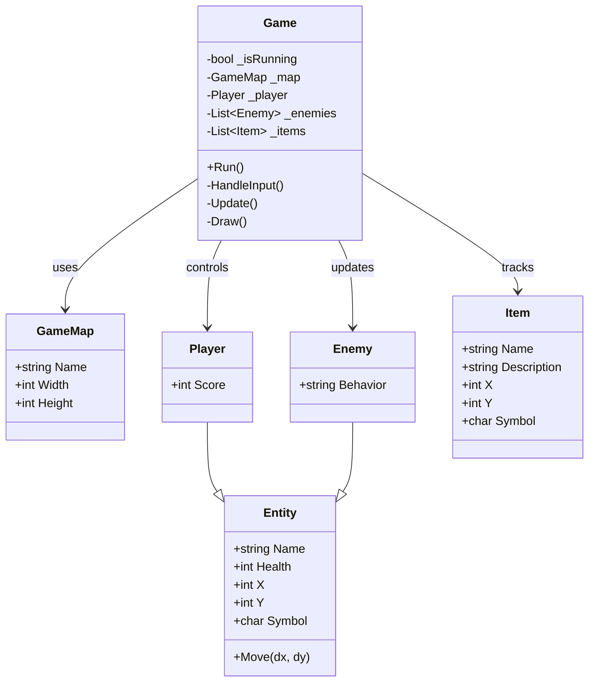

# UML Diagram

```mermaid
classDiagram
    class Game {
        -bool _isRunning
        -GameMap _map
        -Player _player
        -List~Enemy~ _enemies
        -List~Item~ _items
        +Run()
        -HandleInput()
        -Update()
        -Draw()
    }

    class GameMap {
        +string Name
        +int Width
        +int Height
    }

    class Entity {
        +string Name
        +int Health
        +int X
        +int Y
        +char Symbol
        +Move(dx, dy)
    }

    class Player {
        +int Score
    }

    class Enemy {
        +string Behavior
    }

    class Item {
        +string Name
        +string Description
        +int X
        +int Y
        +char Symbol
    }

    Game --> GameMap : uses
    Game --> Player : controls
    Game --> Enemy : updates
    Game --> Item : tracks
    Player --|> Entity
    Enemy --|> Entity
```
